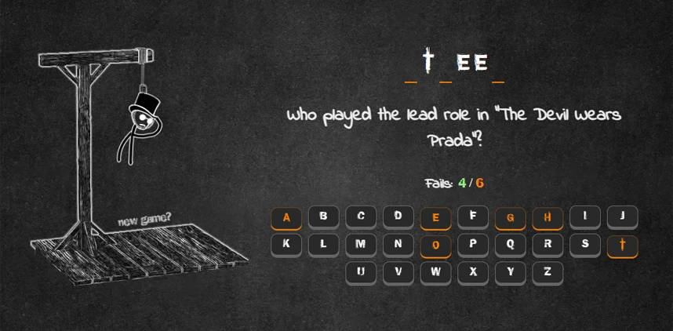

# Hangman game

### Project's Description

[Hangman](<https://en.wikipedia.org/wiki/Hangman_(game)>) is a classic word game in which you must find the correct answer by guessing letters one at a time.

### This project was implemented according to the criteria and rules outlined below:

### Game rules

1. The game is represented by two main parts: **the gallows part** and **the quiz part**.

2. At the beginning of the game, the gallows **is empty**.

3. The quiz part includes:

    - a question,
    - a secret word (the answer to the question), represented by underscores **for each** letter in the word _(for example, if the secret word is 'address' it will be written like '\_ \_ \_ \_ \_ \_ \_')_,
    - an incorrect guesses counter,
    - a virtual keyboard,

4. The user must be able to use **both virtual** _(by clicking letter keys on the screen)_ and **physical keyboards** _(by pressing letter keys on their keyboard)_ to play the game.

5. When the user starts guessing the letters:

    - whenever the letter is guessed correctly, this letter appears **instead of the corresponding underscore(s)** _(for the example mentioned above, if the user clicks or presses the 'd' letter, both 'd's must appear on the screen: '\_ d d \_ \_ \_ \_')_;
    - if the letter is not in the word, **one body part** must be added to the gallows and the incorrect guesses counter **must be updated** accordingly;
    - the clicked/pressed letter **must be disabled** and it must be reflected in the UI _(for example, by using a different color on the disabled button)_;

6. The body parts appear on the gallows in the **following order**: head, body, left arm, right arm, left leg, right leg. It means that the user has **6 attempts** to guess the word.

7. The player will continue guessing letters until either **the word is solved** or **all six body parts** are on the gallows.

8. At the end of the game, a **modal window** must appear. It must:

    - include the **message** that either congratulates the user on winning the game or informs them that they failed to win;
    - the **secret word** (even if it was guessed correctly);
    - a **"play again"** button.

9. When the user clicks on "play again", the game **starts over**:

    - the gallows is **empty**;
    - the question is **changed**;
    - the underscores are **updated** according to the new secret word _(the same secret word can't be used as an answer to more than one question)_;
    - an incorrect guesses counter is **set to 0**.

#### Main functional requirements

- The design must be adaptive (or responsive), that includes desktop (1440px <= width), tablet (768px <= width < 1440px) and mobile (360px <= width < 768px). When switching between versions everything must be displayed correctly, all functionality must be present, no content must disappear or be left beyond the screen.
- Initially, `body` in the `index.html` file **must be empty**, all necessary elements are generated using JS.
- Both at the beginning and in the end of the game, the question-answer pair must be **chosen randomly** (it's recommended to have at least 10 question-answer pairs).
- The application can be done in **English or in Russian**.

### Technical requirements
- The application is displayed correctly and functions properly in the latest version of Google Chrome.
- It is not allowed to use:
    - CSS frameworks (e.g., Bootstrap),
    - JS frameworks (e.g., Angular, React, Vue, etc.),
    - Outdated libraries (e.g. JQuery, etc.),
    - Any JS libraries which are not devDependencies (e.g. lodash),
    - TypeScript.
- You can use CSS preprocessors (SASS, SCSS) and normalize.css.
- It is strongly recommended to use eslint and prettier.

#### CrossCheck Criteria
*It is recommended to print the secret word in the browser's console to facilitate the cross-check process.*

- [x] Responsive/adaptive UI from 1440px to 360px viewport
- [x] The generation of DOM elements is implemented. `body` in the `index.html` is empty (can contain only `script` tag). This requirement can be checked by pressing `Ctrl+U` (Windows) or `Option`(⌥)`+Command`(⌘)`+U` (Mac)
- [x] The game starts with the correct default view (empty gallows, underscores for secret word, etc.) and a random question
- [x] The user can play the game by using the virtual keyboard
- [x] The user can play the game by using the physical keyboard
- [x] When the letter is correct, it appears instead of the corresponding underscore. If the letter repeats in the word, all corresponding underscores must be replaced by it
- [x] When the letter is incorrect:
    - [x] the incorrect guesses counter is updated
    - [x] a body part is added to the gallows
- [x] The clicked/pressed letter is disabled
- [x] The body parts appear on the gallows in the logical order (head, body, left arm, right arm, left leg, right leg)
- [x] When the user runs out of 6 attempts or wins the game, the modal window appears: +10
- [x] The modal window includes the message about the game's outcome (winning or losing), the secret word and the 'play again' button
- [x] When the user clicks the 'play again' button, the game starts over by showing a new question and resetting the gallows, the incorrect guesses counter and the underscores for the secret word