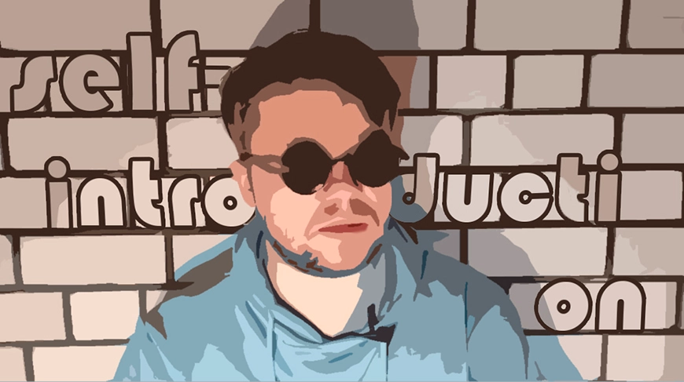

 [](https://youtu.be/VAYgN4aSbt8)

 [Self-introduction here](https://youtu.be/VAYgN4aSbt8)  or click image &#8593;

```
Hi, my name is Anthony and I want to tell you about my journey as a junior frontend developer.
I first became interested in website development in two thousand five. That's when it became possible to connect to the Internet in my town. It was a new unexplored world in which my eyes were fixed on beautiful web pages: portfolios of photographers, musicians, writers. It was mainly creative people, because their personal sites had a certain beauty and creativity about them.
That's when I wanted to develop websites and create something awesome! I spent hours and hours doing it. This is why I decided to devote my life to programming, because I really wanted to learn programming, not just design. 
I graduated from Moscow Polytechnic University. My department was called "Software for Computer Science and Automated Systems".
Yes, it was not what I originally wanted to study, but after many years I was able to return to my original goal. 
I completed a course in basic frontend development from the Innopolis Institute and decided not to stop there, and finally, to bring it to an end. At that time, in the community of those who had passed the courses from Innopolis Institute, Rolling Scope School was advertised, more like recommendations of students. I decided to continue studying at this school and I am still studying, as I can't see my life without frontend now.
Nothing fascinated me as much as creating websites. I spent hours on it in two thousand five and I'm spending hours on it now. I mean, it's so much fun. You can write code and immediately see the result of your efforts! My enthusiasm for Photoshop only contributes to writing sites, also in my free time I prefer walking outdoors, watching movies, listening to music or swimming. 
Every day I learn something new and move on. My journey in frontend is just beginning, but there are still many interesting things to come and I hope that I will be able to realize myself on this path and reach my goal - to become a super expert! Well, it's still ahead of me! I love when a plan comes together!
```